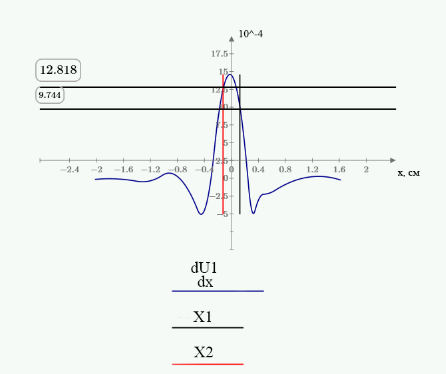
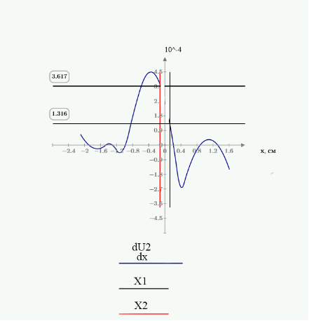
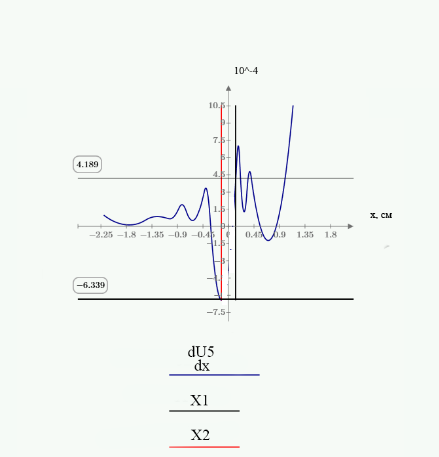
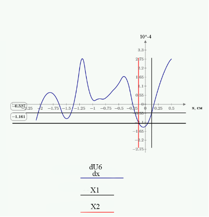
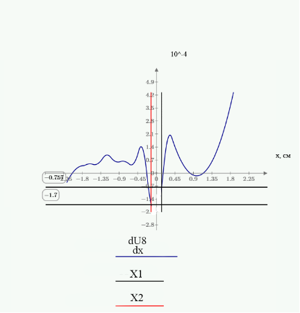
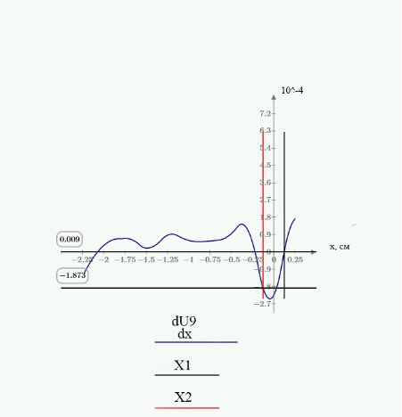
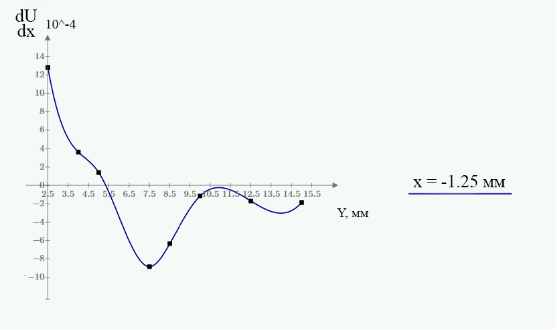

# HolographicStudyOfDeformationDistribution
Holographic study of strain distribution in the vicinity of a circular hole

Оглавления

1\. Пояснительная записка.  

1\.1. Обоснование выбора метода двух экспозиций для регистрации голографических интерферограмм. Особенности данного метода.

1\.2. Расчетная схема интерферометра

1\.3. Метод интерполирующих полиномов. Кубические сплайны. Учёт граничных условий.  

`  `2. Выполнение курсовой работы.  

Список использованной литературы .  

1\. Пояснительная записка

1. Обоснование выбора метода двух экспозиций для регистрации голографических интерферограмм. Особенности данного метода.

Голографическая интерферометрия – это метод оптической интерферометрии, который использует голографию для записи и анализа интерференционных картин.

В классической интерферометрии исследуемая волна и волна сравнения распространяются по двум различным оптическим каналам. В голографической интерферометрии обе волны проходят по одному пути. Волной сравнения служит волна, соответствующая исходному состоянию объекта, записанная на голограмме, а затем восстановленная с нее. Поэтому голографическим методом можно исследовать объекты сложной формы с шероховатой поверхностью, то есть реальные промышленные детали и конструкции, а не их модели.

`	 `Метод двух экспозиций является одним из наиболее распространенных методов регистрации голографических интерферограмм. Он основывается на записи двух голограмм объекта в разных состояниях, а затем на их интерференции. 

Обоснование выбора: 

• Простота реализации: Метод не требует сложной аппаратуры и легко реализуем в лабораторных условиях. 

• Высокая чувствительность: Метод позволяет обнаружить даже малейшие изменения в объекте, что делает его идеальным для исследования деформаций, вибраций и других микроскопических изменений. 

• Получение качественных интерферограмм: Интерференционная картина формируется за счет суперпозиции двух записанных голограмм, что обеспечивает высокую контрастность и четкость интерферограмм. 

• Широкое применение: Метод используется в различных областях, включая механику, материаловедение, аэрокосмическую промышленность и биомедицину. 

Особенности метода двух экспозиций: 

• Запись двух голограмм:  На фотопластинку последовательно записываются две голограммы объекта в разных состояниях (например, до и после деформации). 

• Интерференция голограмм: При восстановлении голограммы происходит интерференция световых волн, прошедших через каждую из записанных голограмм.

` `• Интерференционная картина: В результате интерференции образуется интерференционная картина, которая отображает изменения объекта между двумя состояниями. 

• Обработка интерферограмм: Полученные интерферограммы могут быть проанализированы с помощью специализированных программ для определения параметров деформации, вибрации и других изменений объекта. 

Метод двух экспозиций обладает высокой чувствительностью, позволяющей регистрировать мельчайшие изменения фазовой структуры объекта, что особенно ценно при исследовании микроскопических деформаций и тонких оптических эффектов. Полученные интерферограммы наглядны и легко интерпретируются. Однако, метод чувствителен к вибрациям и шумам, которые могут исказить результаты. Кроме того, необходимость фиксации двух стационарных состояний объекта ограничивает его применение для изучения динамических процессов.

1. Расчетная схема интерферометра

В данной работе объект имеет два изображения разных состояний, что позволяет изучить две координаты смещения. Метод голографической интерферометрии позволяет изучить две составляющие координаты смещения – плоскую и нормальную компоненту. На одну голограмму записываются обе компоненты, а на другую только нормальная компонента.

В данной работе объект имеет два изображения разных состояний, что позволяет изучить две координаты смещения.

Интерферограмма с компонентой W и W+U

Компонента смещения, записана следующим образом:

		

	

` `, где угол φ=90 град

` `N-номер полосы. Номер у черных полос принимаем за целые значения, светлых-полуцелые значения.

Преобразуем формулу, учитывая, что λ= 515 \* 10^-9 м, тогда:

	

При обработке результатов интерферограммы получаем массив значений W зависящих от х через N, где х-координата середины полосы относительно центра отверстий. Следовательно, построив графики W(x),(W+U)(x), можно построить график зависимости U(x), где U(x) находится с помощью формулы:

Графики будем реализовывать в программе MathCAD 10.

1. ` `Метод интерполирующих полиномов. Кубические сплайны. Учёт граничных условий

Во время практической работы нам предстоит графически дифференцировать графики с помощью метода интерполирующих полиномов, в котором происходит аппроксимация экспериментальных данных с последующим дифференцированием. В большинстве практических приложений желательно соединить экспериментальные точки не ломаной линией, а гладкой кривой. Лучше всего для этих целей подходит интерполяция кубическими сплайнами, т. е. отрезками кубических парабол.

Смысл сплайн-интерполяции заключается в том, что в промежутках между точками осуществляется аппроксимация в виде зависимости .     Коэффициенты *a, b, c, d* рассчитывают независимо для каждого промежутка, исходя из граничных условий. Смысл задачи интерполяции состоит в выдаче значения A(t) в любой точке t. Для наиболее наглядного примера поверх интерполирующего графика расставим точки  у(х). 

`         `Хотя кубическая сплайн-аппроксимация проста в применении и обеспечивает сглаживание данных, пользоваться ею нужно с некоторой осторожностью по следующим причинам. Во-первых, если добиваются совпадения сплайн-функции с близко расположенными экспериментальными точками, то может оказаться, что производные будут быстро изменяться даже в том случае, когда сами смещения аппроксимируются точно. Во-вторых, требование непрерывности первых производных и линейности вторых производных эквивалентно предположению, что изучаемый объект деформируется как упругая балка; в результате представление деформаций неупругих материалов или испытуемых образцов со сложным поперечным сечением оказывается излишне гладким. 

2\. Выполнение курсовой работы

1) Разметка трасс сканирования на ксерокопиях двух интерферограмм в масштабе 4:1. Y-координаты трасс отсчитываем от большого отверстия, принимая во внимание то, что диаметр малого отверстия составляет 2,5 мм.
1) Нумерация интерференционных полос в пределах каждой из интерферограмм. Нумерацию осуществляем слева направо, а номера соседних полос не могут отличаться больше, чем на 1. 
1) Определение середин интерференционных полос в точках их пересечения с трассами сканирования и определения Х-координат этих точек.
1) Расчёт цены полосы в соответствии с геометрией схемы записи (длина волны излучения   λ=0,515 мкм).
1) Построение графиков зависимостей W от X и W+U от X для каждой трассы. 
1) Построение разностного графика зависимости U от X 
1) ` `Графическое дифференцирование графика U от X, получение зависимости dU/dx для всех 9 графиков

Интерферограммы:

**Трасса 1 (Y=2.5 мм)**

**Трасса 2 (Y=3,75 мм)**

`                `****

**Трасса №3 (Y=5 мм)**

`                 `****

`                  `****

**Трасса №4 (Y=7,5 мм)**

**Трасса №5 (Y=8,75 мм)**

`                    `****

**Трасса №6 (Y=10 мм)**

**Трасса №7 (Y=12,5 мм)**

`                        `

**Трасса №8 (Y=13,75 мм)**

`                   `****
**

`  `**Трасса №9 (Y=15 мм)**

`        `****

`               `****

- Построение графика зависимости ***dU/dx*** по 9 дискретным значениям для  ***Х=-1,25 мм*** и ***Х=1,25 мм***:  

`              `******

# Список использованной литературы

1) Вест, Ч. Голографическая интерферометрия/ Ч. Вест,- Москва:Мир, 1982. – 504 с.
1) 2) Кольер Р. Оптическая голография/ Р. Кольер, К. Беркхарт, Л. Лин,- Москва:Мир, 1973. – 698с.
1) Визуальная среда математического регулирования MathCAD [Электронный ресурс] 
1) Голографическая интерферометрия [электронный ресурс]. URL: <https://studfile.net/preview/7165232/page:9/>
